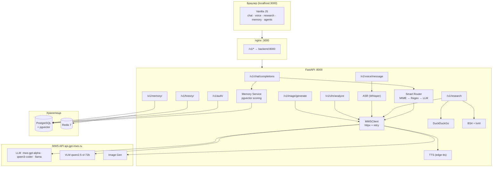
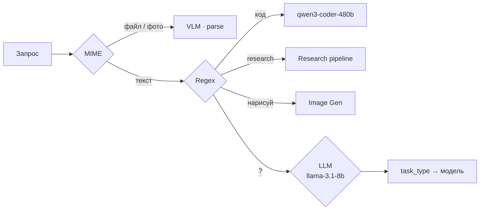
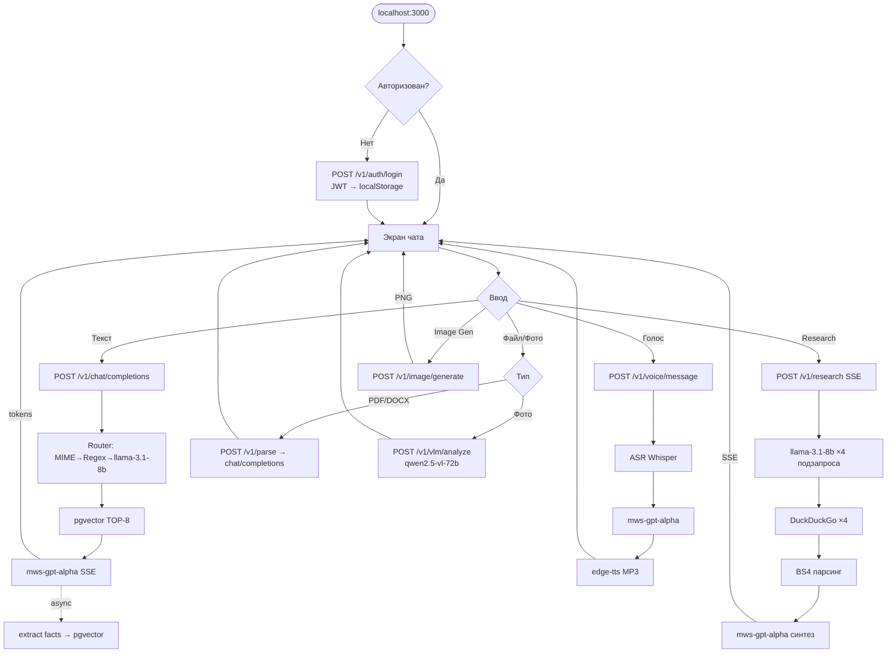

# MTS AI — Architecture & UserFlow

## Компонентная схема



---

## AI-модели

| Роль | Модель |
|---|---|
| Чат / синтез | `mws-gpt-alpha` |
| Код | `qwen3-coder-480b-a35b` |
| Роутер · экстракция фактов · research-запросы | `llama-3.1-8b-instruct` |
| Vision | `qwen2.5-vl-72b-instruct` |
| Генерация изображений | MWS Image endpoint |
| ASR | Whisper-compatible |
| TTS | edge-tts (SvetlanaNeural) |

Дополнительно в UI: `DeepSeek-R1`, `Llama-3.3-70b`, `GLM-4.6`, `Gemma`, `Kimi K2`.

---

## Внешние зависимости

| | Тип | Назначение |
|---|---|---|
| `api.gpt.mws.ru` | SaaS HTTP/SSE | LLM, VLM, Image Gen |
| DuckDuckGo | Публичный API | Поиск в Deep Research |
| edge-tts | Библиотека | Синтез речи |
| PostgreSQL + pgvector | Docker | История, память, сессии |
| Redis | Docker | Кэш |

---

## Умный роутер — 3 прохода



---

## Память — жизненный цикл

```
ответ ассистента
  → async: llama-3.1-8b → key/value/category
  → pgvector embed (1536d) → INSERT user_memory
  → следующий запрос: SELECT TOP-8 cosine+recency
  → инжект в system_prompt
```

---

## UserFlow



---

## Контур сервисов по сценариям

```
ТЕКСТОВЫЙ ЧАТ
  Browser → nginx → /v1/chat/completions
    → Router (MIME → Regex → llama-3.1-8b)
    → pgvector TOP-8 → system_prompt
    → MWS API [mws-gpt-alpha | qwen3-coder]  SSE → Browser
    → async: llama-3.1-8b → pgvector
    → PostgreSQL: Message + Conversation

ГОЛОС
  Browser → /v1/voice/message
    → ASR (Whisper) → mws-gpt-alpha → edge-tts → MP3 → Browser

VLM
  Browser → /v1/vlm/analyze
    → qwen2.5-vl-72b → текст → Browser

DEEP RESEARCH
  Browser → /v1/research  SSE
    → llama-3.1-8b (×4 подзапроса)
    → DuckDuckGo (×4 параллельно) → BS4 парсинг
    → mws-gpt-alpha (синтез + сноски) → SSE → Browser

IMAGE GEN
  Browser → /v1/image/generate
    → MWS Image API → base64 PNG → Browser
```
